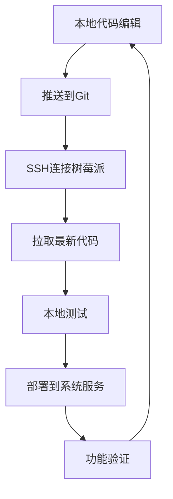

# 资源链接

本页面汇总了VerdiBot相关的所有资源链接，方便大家查找和使用。

## 官方项目资源

### 代码仓库

| 项目 | GitHub地址 | 描述 |
|------|------------|------|
| **VerdiBot主项目** | [maker-community/VerdiBot](https://github.com/maker-community/VerdiBot) | 主要项目仓库，包含文档和3D模型 |
| **小智语音助手** | [maker-community/Verdure.Assistant](https://github.com/maker-community/Verdure.Assistant) | 语音交互系统 |
| **WiFi配网工具** | [maker-community/PiWiFiAP](https://github.com/maker-community/PiWiFiAP) | 树莓派WiFi配置工具 |
| **项目文档网站** | [verdibot.verdure-hiro.cn](http://verdibot.verdure-hiro.cn/) | 在线文档 |

### 硬件设计文件

| 资源 | 链接 | 格式 | 描述 |
|------|------|------|------|
| **PCB设计文件** | [立创开源社区](https://oshwhub.com/greenshade/verdibot) | EDA工程文件 | 完整的PCB设计 |
| **3D打印文件** | [GitHub 3D模型](https://github.com/maker-community/VerdiBot/tree/main/3d-model) | STL文件 | 所有结构件模型 |
| **原理图PDF** | [GitHub Schematics](https://github.com/maker-community/VerdiBot/tree/main/schematics) | PDF | 电路原理图 |

## 学习资源

### 视频教程

| 内容 | 作者 | 平台 | 链接 |
|------|------|------|------|
| **VerdiBot制作全流程** | 绿荫阿广 | Bilibili | [BV1N2hCzfEJU](https://www.bilibili.com/video/BV1N2hCzfEJU/) |
| **PCB焊接教程** | 绿荫阿广 | Bilibili | [个人主页](https://space.bilibili.com/25228512) |
| **3D打印技巧** | 绿荫阿广 | Bilibili | [个人主页](https://space.bilibili.com/25228512) |

### 技术文档

#### 树莓派相关
- [树莓派官方文档](https://www.raspberrypi.org/documentation/) - 官方技术文档
- [树莓派GPIO引脚图](https://pinout.xyz/) - GPIO接口说明
- [Raspberry Pi OS下载](https://www.raspberrypi.com/software/) - 官方系统镜像

#### 电子技术基础
- [立创EDA教程](https://docs.lceda.cn/) - PCB设计工具教程
- [KiCad官方教程](https://docs.kicad.org/) - 开源PCB设计工具
- [Altium Designer教程](https://www.altium.com/documentation) - 专业PCB设计工具

#### 3D打印相关
- [Prusa切片软件](https://www.prusa3d.com/page/prusaslicer_424/) - 推荐切片软件
- [Cura切片软件](https://ultimaker.com/software/ultimaker-cura) - 免费切片软件
- [Thingiverse模型库](https://www.thingiverse.com/) - 3D模型分享平台

## 工具软件

### 设计工具

| 软件名称 | 类型 | 平台 | 免费版 | 下载链接 |
|---------|------|------|--------|---------|
| **立创EDA** | PCB设计 | Web/桌面 | ✅ | [lceda.cn](https://lceda.cn/) |
| **KiCad** | PCB设计 | Win/Mac/Linux | ✅ | [kicad.org](https://www.kicad.org/) |
| **Fusion 360** | 3D建模 | Win/Mac | 🔄 个人版 | [autodesk.com](https://www.autodesk.com/products/fusion-360/) |
| **FreeCAD** | 3D建模 | Win/Mac/Linux | ✅ | [freecadweb.org](https://www.freecadweb.org/) |
| **PrusaSlicer** | 3D切片 | Win/Mac/Linux | ✅ | [prusa3d.com](https://www.prusa3d.com/page/prusaslicer_424/) |

### 开发工具

| 软件名称 | 用途 | 平台 | 推荐度 | 下载链接 |
|---------|------|------|--------|---------|
| **VS Code** | 代码编辑 | Win/Mac/Linux | ⭐⭐⭐⭐⭐ | [code.visualstudio.com](https://code.visualstudio.com/) |
| **Thonny** | Python IDE | Win/Mac/Linux | ⭐⭐⭐⭐ | [thonny.org](https://thonny.org/) |
| **PuTTY** | SSH客户端 | Windows | ⭐⭐⭐⭐ | [putty.org](https://www.putty.org/) |
| **VNC Viewer** | 远程桌面 | Win/Mac/Linux | ⭐⭐⭐⭐ | [realvnc.com](https://www.realvnc.com/en/connect/download/viewer/) |

### 调试工具

| 工具名称 | 功能 | 平台 | 备注 |
|---------|------|------|------|
| **Raspberry Pi Imager** | SD卡烧录 | Win/Mac/Linux | 官方工具 |
| **balenaEtcher** | SD卡烧录 | Win/Mac/Linux | 第三方工具 |
| **Advanced IP Scanner** | 网络扫描 | Windows | IP地址查找 |
| **nmap** | 网络扫描 | Linux/Mac | 命令行工具 |

## 元器件采购

### 推荐供应商

#### 国内供应商

**电子元器件**
| 供应商 | 特点 | 优势 | 官网 |
|--------|------|------|------|
| **立创商城** | 现货充足 | 价格透明，次日达 | [lcsc.com](https://lcsc.com/) |
| **得捷电子** | 原厂正品 | 质量保证，技术支持 | [digikey.cn](https://www.digikey.cn/) |
| **贸泽电子** | 品种齐全 | 新产品多，库存准确 | [mouser.cn](https://www.mouser.cn/) |

**树莓派及配件**
| 供应商 | 特点 | 推荐产品 | 联系方式 |
|--------|------|---------|---------|
| **树莓派实验室** | 官方授权 | 全系列产品 | [rpishop.cn](http://rpishop.cn/) |
| **硬禾实战** | 专业服务 | 配套齐全 | [yhsz.com](https://www.yhsz.com/) |
| **微雪电子** | 技术支持好 | 扩展板丰富 | [waveshare.com](https://www.waveshare.com/) |

#### 海外供应商

| 供应商 | 特点 | 优势 | 官网 |
|--------|------|------|------|
| **Adafruit** | 创客友好 | 教程丰富，质量好 | [adafruit.com](https://www.adafruit.com/) |
| **SparkFun** | 开源硬件 | 产品创新，技术支持 | [sparkfun.com](https://www.sparkfun.com/) |
| **Pimoroni** | 树莓派专家 | 英国制造，设计精美 | [pimoroni.com](https://pimoroni.com/) |

### PCB制造服务

| 制造商 | 特点 | 价格 | 质量 | 交期 | 推荐度 |
|--------|------|------|------|------|--------|
| **嘉立创PCB** | 性价比高 | ⭐⭐⭐⭐⭐ | ⭐⭐⭐⭐ | 24-48小时 | ⭐⭐⭐⭐⭐ |
| **华强PCB** | 工艺齐全 | ⭐⭐⭐ | ⭐⭐⭐⭐⭐ | 3-5天 | ⭐⭐⭐⭐ |
| **捷配PCB** | 加急服务 | ⭐⭐ | ⭐⭐⭐⭐ | 12-24小时 | ⭐⭐⭐ |

### 3D打印服务

| 服务商 | 材料 | 精度 | 价格 | 推荐度 |
|--------|------|------|------|--------|
| **嘉立创3D打印** | PLA/ABS/PETG | 0.1mm | ⭐⭐⭐⭐ | ⭐⭐⭐⭐⭐ |
| **闪铸科技** | 多种材料 | 0.05mm | ⭐⭐⭐ | ⭐⭐⭐⭐ |
| **本地打印店** | 基础材料 | 0.2mm | ⭐⭐⭐⭐⭐ | ⭐⭐⭐ |

## 技术支持

### 社区论坛

| 平台 | 描述 | 活跃度 | 链接 |
|------|------|--------|------|
| **VerdiBot QQ群** | 816250966 | 🔥🔥🔥🔥🔥 | 直接搜索群号 |
| **GitHub Issues** | 问题反馈 | 🔥🔥🔥🔥 | [项目Issues页面](https://github.com/maker-community/VerdiBot/issues) |
| **树莓派中文社区** | 技术交流 | 🔥🔥🔥 | [rpicn.org](http://rpicn.org/) |
| **立创社区论坛** | PCB技术 | 🔥🔥🔥 | [club.szlcsc.com](https://club.szlcsc.com/) |

### 博客和文档

| 资源 | 作者 | 内容 | 链接 |
|------|------|------|------|
| **绿荫阿广的博客** | 项目作者 | 项目更新、技术分享 | [cnblogs.com/GreenShade](https://www.cnblogs.com/GreenShade) |
| **树莓派实验室博客** | 技术团队 | 树莓派应用案例 | [shumeipai.nxez.com](https://shumeipai.nxez.com/) |

### 技术文档

#### API文档
- [树莓派GPIO库文档](https://gpiozero.readthedocs.io/) - GPIO控制库
- [OpenCV Python文档](https://docs.opencv.org/4.x/d6/d00/tutorial_py_root.html) - 计算机视觉
- [PyAudio文档](https://pypi.org/project/PyAudio/) - 音频处理

#### 协议规范
- [I2C协议详解](https://www.i2c-bus.org/) - I2C通信协议
- [SPI协议详解](https://www.analog.com/en/analog-dialogue/articles/introduction-to-spi-interface.html) - SPI通信协议
- [UART协议详解](https://en.wikipedia.org/wiki/Universal_asynchronous_receiver-transmitter) - 串口通信

## 开发资源

### 开源库和框架

#### Python库
```bash
# GPIO控制
pip install RPi.GPIO gpiozero

# 显示驱动
pip install luma.oled luma.lcd

# 音频处理  
pip install pyaudio sounddevice

# 图像处理
pip install opencv-python pillow

# 网络通信
pip install requests websockets flask
```

#### JavaScript/Node.js
```bash
# GPIO控制
npm install rpi-gpio onoff

# 音频处理
npm install node-record-lpcm16 speaker

# Web框架
npm install express socket.io
```

### 开发环境

#### 推荐的开发配置
```yaml
本地开发:
  - IDE: VS Code + Remote SSH插件
  - 调试: Python Debugger
  - 版本控制: Git + GitHub

远程开发:
  - SSH: 密钥登录 + 端口转发
  - 文件同步: rsync 或 scp
  - 日志查看: journalctl 或 tail
```

#### 开发工作流


## 学习路径

### 初学者路径 (0-3个月)

**第1月：基础知识**
- [ ] 学习基本电子知识
- [ ] 熟悉树莓派使用
- [ ] 掌握Linux基础命令
- [ ] 学习Python基础编程

**第2月：硬件制作**
- [ ] 学习PCB基础知识
- [ ] 练习基本焊接技能
- [ ] 了解3D打印工艺
- [ ] 制作简单的电子项目

**第3月：项目实践**
- [ ] 开始VerdiBot制作
- [ ] 学习问题排查方法
- [ ] 参与社区交流
- [ ] 分享制作经验

### 进阶路径 (3-12个月)

**技能提升**
- [ ] 深入学习PCB设计
- [ ] 掌握高级焊接技巧
- [ ] 学习机械设计知识
- [ ] 提升编程能力

**项目扩展**
- [ ] 自定义功能开发
- [ ] 性能优化和调试
- [ ] 开发新的硬件模块
- [ ] 贡献开源社区

### 专家路径 (1年以上)

**深度技术**
- [ ] 射频和通信技术
- [ ] 嵌入式系统设计
- [ ] 机器学习和AI集成
- [ ] 产品化和商业化

**社区贡献**
- [ ] 技术文档编写
- [ ] 新手指导和培训
- [ ] 开源项目维护
- [ ] 技术分享和演讲

---

## 版权和许可

### 开源协议
- **VerdiBot项目**: MIT License
- **硬件设计**: CERN Open Hardware Licence v2
- **文档**: Creative Commons CC BY-SA 4.0

### 商业使用
根据MIT协议，本项目允许商业使用，但请：
- 保留原始版权声明
- 在衍生作品中注明来源
- 遵守相关开源协议条款

### 贡献指南
欢迎为项目贡献代码、文档或其他资源：
1. Fork项目仓库
2. 创建功能分支
3. 提交Pull Request
4. 通过代码审查

---

::: tip 资源使用建议
- 优先使用官方和权威资源
- 注意软件版本兼容性
- 保存重要资源的本地备份
- 关注项目更新和安全公告
:::

**相关页面**:
- [常见问题](/zh/appendix/faq)
- [社区支持](/zh/appendix/community)