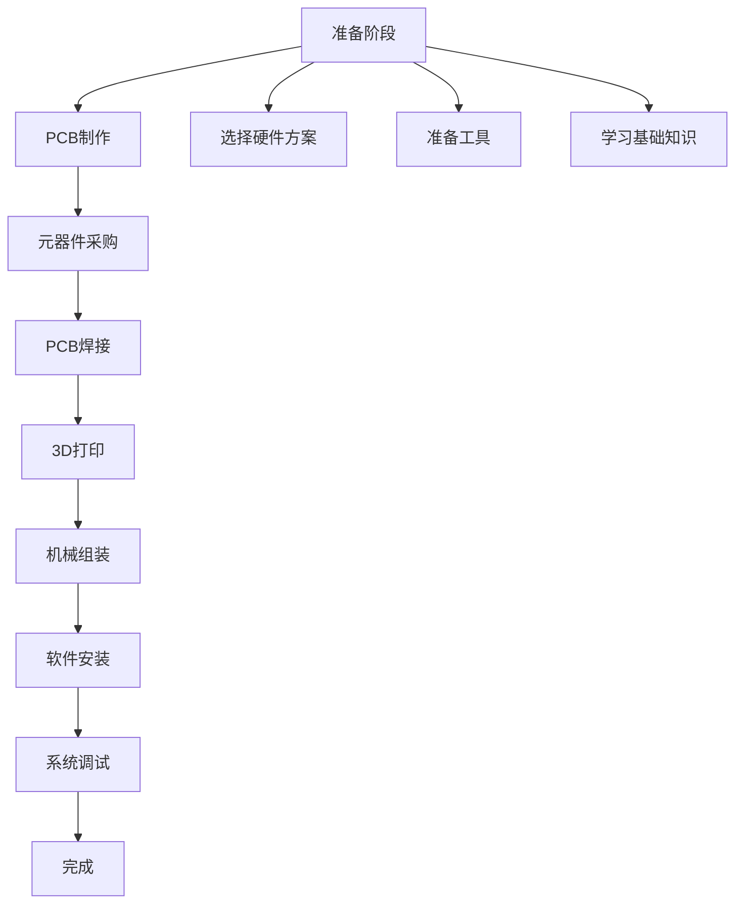

# 快速开始

欢迎来到VerdiBot的制作世界！本指南将带你快速了解整个制作流程，让你对项目有个全面的认识。

## 制作流程概览



## 第一步：选择你的方案

### 方案对比快览

| 项目 | 树莓派5方案 | 树莓派Zero 2W方案 |
|------|------------|------------------|
| 💰 **预算** | ¥800-1400 | ¥400-800 |
| ⚡ **性能** | 高性能流畅 | 基础功能够用 |
| 🔧 **难度** | 中等偏高 | 相对简单 |
| 🎯 **推荐人群** | 有经验的创客 | 初学者首选 |

::: tip 选择建议
- **第一次制作**: 推荐Zero 2W方案，成本低、风险小
- **追求体验**: 选择Pi 5方案，性能强、功能全
- **预算有限**: Zero 2W方案，够用就好
- **技术进阶**: Pi 5方案，挑战更大项目
:::

## 第二步：准备工作

### 必备知识储备

在开始制作前，建议具备以下基础知识：

#### 🔌 电子基础
- [ ] 了解基本电路原理
- [ ] 掌握万用表使用方法
- [ ] 熟悉常见电子元器件
- [ ] 理解电压、电流、电阻概念

#### 🔧 焊接技能
- [ ] 掌握基本焊接技巧
- [ ] 了解SMD和DIP元器件焊接
- [ ] 熟悉焊接工具使用
- [ ] 能够进行焊接质量检查

#### 🖥️ 软件基础
- [ ] 基本的Linux命令行操作
- [ ] 了解树莓派系统安装
- [ ] 基础的文件管理操作
- [ ] 简单的配置文件修改

#### 🔩 机械装配
- [ ] 使用基本工具（螺丝刀、镊子等）
- [ ] 理解装配图和说明书
- [ ] 有耐心进行精细操作

### 学习资源推荐

如果你在某些方面还不够熟悉，可以参考以下资源：

**电子基础**
- [电子基础知识入门](https://www.bilibili.com/video/BV1xx411j7jG/)
- [万用表使用教程](https://www.bilibili.com/video/BV1Yb411o7m6/)

**焊接技能**
- [焊接入门教程](https://www.bilibili.com/video/BV1Wx411j7Wc/)
- [SMD焊接技巧](https://www.bilibili.com/video/BV1zx411j7Ed/)

**树莓派基础**
- [树莓派入门指南](https://www.raspberrypi.org/documentation/)
- [Linux命令行基础](https://www.bilibili.com/video/BV1Sv411r7vd/)

## 第三步：制作时间规划

### 时间预估

根据经验水平不同，制作时间会有较大差异：

#### 新手用户（第一次制作）
- **准备学习**: 1-2周
- **PCB制作等待**: 3-7天
- **元器件采购**: 3-7天  
- **焊接组装**: 2-3天
- **软件调试**: 1-2天
- **总计**: 约3-4周

#### 有经验用户
- **准备工作**: 1-2天
- **制造等待**: 3-7天
- **焊接组装**: 1天
- **软件调试**: 半天
- **总计**: 约1-2周

### 制作计划建议

**第一周：准备和学习**
- [ ] 选择硬件方案
- [ ] 学习必要的基础知识
- [ ] 准备工具和工作环境
- [ ] 下单PCB制作

**第二周：采购和等待**
- [ ] 采购电子元器件
- [ ] 安排3D打印
- [ ] 等待PCB到货
- [ ] 复习焊接技巧

**第三周：制作组装**
- [ ] PCB焊接和测试
- [ ] 机械结构组装
- [ ] 硬件连接调试
- [ ] 基础功能测试

**第四周：软件和优化**
- [ ] 系统安装配置
- [ ] 软件功能调试
- [ ] 整体优化调整
- [ ] 功能完善测试

## 第四步：获取必要资源

### 设计文件和代码

所有项目文件都已开源，你可以通过以下方式获取：

```bash
# 1. 克隆主仓库
git clone https://github.com/maker-community/VerdiBot.git
cd VerdiBot

# 2. 查看项目结构
ls -la
# 3d-model/     # 3D打印文件
# assets/       # 图片资源
# README.md     # 项目说明
# LICENSE       # 开源协议

# 3. 获取PCB设计文件
# 访问：https://oshwhub.com/greenshade/verdibot
```

### 相关项目代码

```bash
# 语音助手代码
git clone https://github.com/maker-community/Verdure.Assistant.git

# WiFi配网项目  
git clone https://github.com/maker-community/PiWiFiAP.git
```

### 社区资源

- **QQ复刻群**: 816250966（遇到问题可以求助）
- **B站教程**: [绿荫阿广的频道](https://space.bilibili.com/25228512)
- **GitHub Issues**: [提问和反馈](https://github.com/maker-community/VerdiBot/issues)
- **立创开源**: [硬件设计文件](https://oshwhub.com/greenshade/verdibot)

## 第五步：开始制作之旅

现在你已经做好了所有准备，可以正式开始制作了！

### 推荐的制作顺序

1. **[硬件需求了解](/zh/guide/requirements)** - 详细了解所需材料
2. **[PCB制作](/zh/hardware/pcb-manufacturing)** - 开始硬件制作
3. **[物料采购](/zh/hardware/bill-of-materials)** - 采购所需元器件
4. **[PCB焊接](/zh/hardware/pcb-soldering)** - 焊接电路板
5. **[3D打印](/zh/hardware/3d-printing)** - 制作外壳结构
6. **[机器人组装](/zh/assembly/preparation)** - 组装所有部件
7. **[软件安装](/zh/software/system-installation)** - 安装配置系统

### 遇到问题怎么办？

制作过程中遇到问题是很正常的，不要灰心：

1. **查阅文档**: 先查看相关章节的详细说明
2. **搜索社区**: 在QQ群或GitHub中搜索类似问题
3. **求助社区**: 在群里或GitHub Issues中提问
4. **参考视频**: 观看B站相关制作视频
5. **循序渐进**: 不要急于求成，一步步来

---

## 特别提醒

::: warning 安全第一
- 焊接时注意用电安全，保持工作环境通风
- 使用工具时小心操作，避免划伤
- 首次通电前仔细检查电路连接
- 遇到烟雾或异味立即断电检查
:::

::: tip 成功秘诀
1. **耐心细致**: 制作过程需要耐心，不要急躁
2. **仔细检查**: 每一步完成后都要检查确认
3. **记录过程**: 拍照记录，便于问题排查
4. **循序渐进**: 按照文档步骤，不要跳步骤
5. **求助社区**: 遇到困难及时求助，不要死磕
:::

准备好了吗？让我们开始这个有趣的制作之旅吧！

**下一步**: [详细了解硬件需求](/zh/guide/requirements)